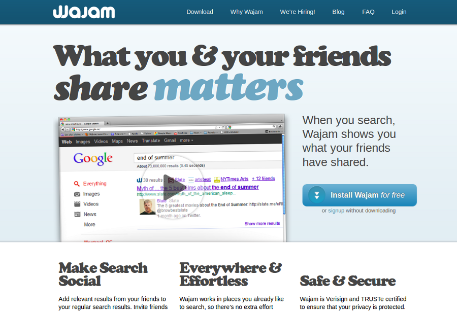

title       : Montreal R Users
subtitle    : Wow session
author      : Corey Chivers
job         : PhD Candidate, Data Hacker
logo        : mtlRlogo.png
framework   : io2012        # {io2012, html5slides, shower, dzslides, ...}
highlighter : highlight.js  # {highlight.js, prettify, highlight}
hitheme     : tomorrow      # 
widgets     : [mathjax]     # {mathjax, quiz, bootstrap}
mode        : standalone    # {standalone, draft}

--- .class #id 

### Welcome to the

<center></center>
<br>
<br>
<br>
<br>
<br>
Sponsored by:  
  [](http://www.revolutionanalytics.com/)

---
## R does statistics

--- 

```r
hw <- read.csv("data/heightweight.csv")
fit <- lm(weightLb ~ heightIn, data = hw)
plot(weightLb ~ heightIn, data = hw, xlab = "Height (Inches)", ylab = "Weight (Lbs)")
abline(fit, lty = 2)
```

 


----
## R does reproducible research

---

[knitr](http://yihui.name/knitr/) + git 

 + 

    library(knitr)
    knit('001-minimal.Rmd')
    
Let us change our traditional attitude to the construction of programs: Instead of imagining that our main task is to instruct a computer what to do, let us concentrate rather on explaining to humans what we want the computer to do.
 -- Donald E. Knuth, Literate Programming, 1984

---

## R does GIS

---

<center>[](http://spatialanalysis.co.uk/2012/02/great-maps-ggplot2/)</center>

---

<center>[](http://www.youtube.com/watch?v=hJE2_XMdfTk)</center>


---

## R does (competitive) datamining

---
### Tool of choice for [Kagglers](http://kaggle.com/)

<center>[](http://blog.kaggle.com/2011/11/27/kagglers-favorite-tools/)</center>

---
### Observing dark worlds Kaggle competition
<center>[](http://bayesianbiologist.com/2012/10/13/observing-dark-worlds-visualizing-dark-matters-distorting-effect-on-galaxies/)</center>

---
### [LDA Topic modelling of the Sarah Palin Emails](http://blog.echen.me/2011/06/27/topic-modeling-the-sarah-palin-emails/)
* Wildlife: 
  * game, fish, moose, wildlife, hunting, bears, polar, bear, subsistence, management, area, board, hunt, wolves, control, department, year, use, wolf, habitat, hunters, caribou, program, denby, fishing, …
  
* Energy/Fuel/Oil/Mining:
  * energy, fuel, costs, oil, alaskans, prices, cost, nome, now, high, being, home, public, power, mine, crisis, price, resource, need, community, fairbanks, rebate, use, mining, villages, …
  
* Trig/Family/Inspiration:
  * family, web, mail, god, son, from, congratulations, children, life, child, down, trig, baby, birth, love, you, syndrome, very, special, bless, old, husband, years, thank, best, …
  
* Education/Waste:
  * school, waste, education, students, schools, million, read, email, market, policy, student, year, high, news, states, program, first, report, business, management, bulletin, information, reports, 2008, quarter, …

---
## R does Business Intelligence

---

### Demand forecasting at John Deere

<center>[](http://www.revolutionanalytics.com/news-events/free-webinars/2012/order-fulfillment-forecasting-at-john-deere/)</center>

---
<center>[](http://www.amazon.com/R-Business-Analytics-A-Ohri/dp/1461443423)</center>

---
## R does Big Data

---
<center>[](http://techcrunch.com/2012/10/27/big-data-right-now-five-trendy-open-source-technologies/)</center>

### "The R community is one of the most thrilling places to be in Big Data right now." --TechCrunch

---
### R and Hadoop

<center>[](http://blog.revolutionanalytics.com/2011/09/mapreduce-hadoop-r.html)</center>

---
## R does journalism

---
<center>[](http://www.nytimes.com/interactive/2012/05/05/sports/baseball/mariano-rivera-and-his-peers.html?ref=baseball)</center>

---

<center>[](http://www.nytimes.com/imagepages/2008/04/16/us/20080416_OBAMA_GRAPHIC.html)</center>

---
## R does the web

---

<center>[](https://www.facebook.com/notes/facebook-engineering/visualizing-friendships/469716398919)</center>

---

<center></center>

http://research.google.com/pubs/pub37483.html

---
<center>[](http://www.wajam.com/)</center>

---

# Easy web apps with Shiny

http://www.rstudio.com/shiny/

---
## Community development, community support

---
# Packages on CRAN
<center></center>

---
<center></center>

---
## Thank you for hosting!
<center></center>

--- 
## Source

These slides were created using [Ramnath Vaidyanathan](https://github.com/ramnathv)'s [Slidify package](http://ramnathv.github.com/slidify/)

Slide source available on [github](https://github.com/MontrealRUserGroup/rwowdeck)


